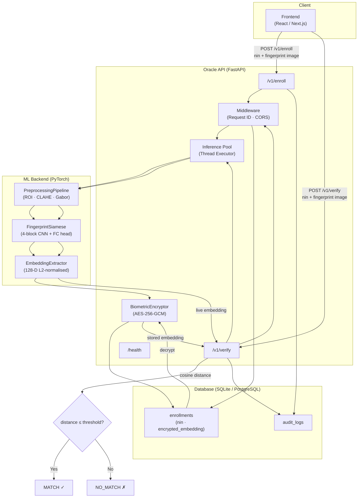

# NINAuth — Architecture Overview

## System Overview

NINAuth is a privacy-preserving, decentralised biometric identity verification system. It combines a Siamese Neural Network (fingerprint matching), AES-256-GCM encrypted template storage, and a FastAPI microservice.

---

## Architecture Diagram



---

## Component Descriptions

| Component | Location | Responsibility |
|-----------|----------|---------------|
| **PreprocessingPipeline** | `ml-backend/preprocessing/pipeline.py` | ROI extraction, CLAHE, Gabor filtering, resize, normalise |
| **FingerprintSiamese** | `ml-backend/models/siamese.py` | 4-block CNN → 128-D L2-normalised embedding |
| **EmbeddingExtractor** | `ml-backend/embedding.py` | Loads trained weights, runs inference for a single image |
| **BiometricEncryptor** | `oracle-api/crypto.py` | AES-256-GCM encrypt/decrypt embedding vectors |
| **Oracle API** | `oracle-api/main.py` | FastAPI service: enrol, verify, health, audit log |
| **Database** | SQLite (dev) / PostgreSQL (prod) | Stores encrypted embeddings and audit trail |
| **Frontend** | `frontend/` (Phase 7) | Citizen & verifier portal |
| **Blockchain** | `blockchain/` (Phase 6) | On-chain NIN registry (Solidity, Sepolia) |

---

## Data Flow — Enrolment

```
Citizen → POST /v1/enroll (NIN + fingerprint image)
  │
  ├─ validate NIN format (11 digits)
  ├─ validate image (MIME, size, decodability)
  ├─ PreprocessingPipeline.process(img)
  │     ROI extraction → CLAHE → Gabor → resize 128×128 → normalise [0,1]
  ├─ FingerprintSiamese.forward_once(tensor) → embedding[128]
  ├─ BiometricEncryptor.encrypt_vector(embedding) → base64 string
  ├─ DB upsert: enrollments(nin, encrypted_embedding)
  └─ Response: { nin, status:"enrolled", request_id, timestamp }
```

## Data Flow — Verification

```
Verifier → POST /v1/verify (NIN + live fingerprint image)
  │
  ├─ validate NIN + image
  ├─ DB fetch: enrollments WHERE nin = ?
  ├─ BiometricEncryptor.decrypt_vector(encrypted_embedding) → stored_emb[128]
  ├─ PreprocessingPipeline.process(live_img)
  ├─ FingerprintSiamese.forward_once(tensor) → live_emb[128]
  ├─ cosine_distance = 1 - cosine_similarity(live_emb, stored_emb)
  ├─ decision = "MATCH" if distance ≤ threshold else "NO_MATCH"
  └─ Response: { nin, similarity, distance, threshold, decision, request_id, timestamp }
```

---

## Security Properties

| Property | Implementation |
|----------|---------------|
| **No raw biometrics stored** | Only AES-256-GCM ciphertext stored in DB |
| **Nonce-per-encryption** | Fresh 12-byte random nonce every `encrypt_vector()` call |
| **API authentication** | SHA-256 hashed API key, checked on every request |
| **Audit trail** | Every enrol/verify event logged with IP, decision, distance |
| **No PII in logs** | NIN logged only for audit; no image bytes logged |
